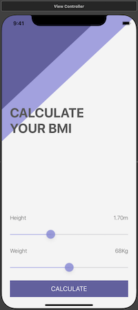
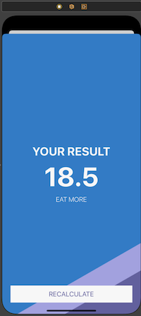

# BMICalculator
A BMI Calculator iOS App Native

Applying the concepts:

* Clases
* Optionals
* Structures
* User Interface programmatically
* Color Literals
* Sliders
* Multi-screen 
* multi-screen with Segues

# Functionality
A beautiful Body mass index (BMI) Calculator App which will be able to calculate a user's BMI.

## Screenshots

|  Calculate      |  Result      |
|------------|-------------|
|  |    |

